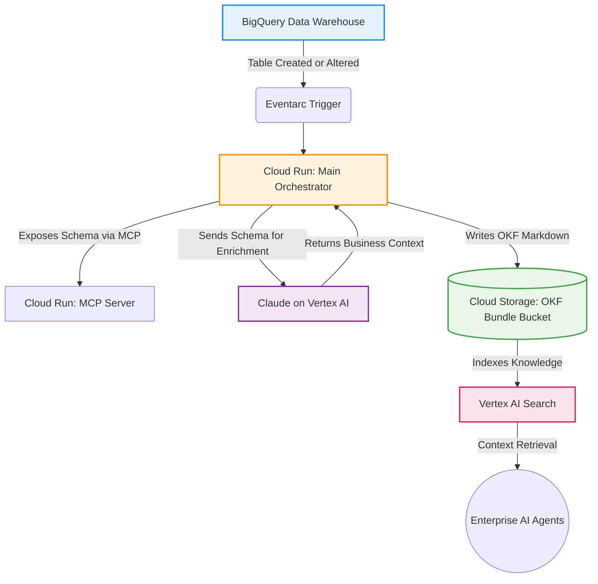

# OKF Context Bridge (Enterprise Edition)

An automated, event-driven enterprise metadata pipeline that bridges the "context gap" for AI agents. This platform automatically monitors Google Cloud BigQuery data warehouses, extracts raw schemas via the Model Context Protocol (MCP), enriches them with business context using Claude 3.5 Sonnet on Vertex AI, and compiles them into Open Knowledge Format (OKF) bundles stored in Cloud Storage.

## Why This Exists

Enterprise AI agents struggle to write accurate SQL or perform reliable analysis because they lack business context. While a human engineer knows that `vpa_id` means "Virtual Payment Address for UPI", an AI model reading a raw database schema does not. This lack of context leads to hallucinated queries, broken joins, and analytical errors.

To solve this, Google Cloud published the Open Knowledge Format (OKF) version 0.1 on June 12, 2026. OKF is an open, vendor-neutral specification that represents knowledge as a directory of markdown files with YAML frontmatter. This gives AI agents a standardized way to read, write, and exchange knowledge without proprietary platforms, SDKs, or lock-in.

However, manually documenting thousands of enterprise tables is impossible. The **OKF Context Bridge** automates this entirely at scale.

---

## Enterprise Architecture

This platform runs entirely serverless on Google Cloud Platform, reacting dynamically whenever data infrastructure changes.



### Component Breakdown

*   **The Trigger (Eventarc & Cloud Scheduler):** Eliminates manual execution. Eventarc listens for Audit Logs indicating `CREATE TABLE` or `ALTER TABLE` events in BigQuery, triggering the pipeline immediately.
*   **The Secure Access Layer (Model Context Protocol):** The database connection is completely decoupled. The schemas are exposed securely as standardized "tools" to the orchestrator.
*   **The Compute Engine (Cloud Run):** The Python orchestrator is containerized and runs on Google Cloud Run, automatically scaling to zero when no schema updates are occurring.
*   **The Core Cognitive Layer (Claude on Vertex AI):** Schema payload enrichment is routed through Google Cloud Vertex AI. This guarantees that your proprietary enterprise schemas never leave your secure Google Cloud compliance boundary.
*   **The Knowledge Target (Cloud Storage & Vertex AI Search):** The compiled `.md` files are streamed to a Google Cloud Storage bucket. This bucket is connected directly to Vertex AI Search, making your entire data warehouse's business context instantly searchable.

---

## OKF v0.1 Conformance Details

This pipeline generates files that strictly adhere to the OKF v0.1 specification:

*   **YAML Frontmatter:** Every concept file opens with a YAML frontmatter block. 
*   **Required Fields:** The format requires exactly one frontmatter field in every concept: `type`. 
*   **Optional Fields:** Recommended optional fields include `title`, `description`, `resource`, `tags`, and `timestamp`. Our pipeline populates all of these to maximize semantic searchability.
*   **Reserved Files:** Bundles can optionally include `index.md` files (for progressive disclosure) and `log.md` files (for change history).
*   **Graph Linking:** Concepts link to each other with standard markdown links, which turns the directory into a graph that is richer than file-system parent/child relationships.

---

## Repository Structure

*   `.gitignore`: Standard Python and GCP security exclusions.
*   `README.md`: Project documentation and system architecture.
*   `requirements.txt`: Project dependencies (Anthropic Vertex, MCP SDK, PyYAML).
*   `mock_db_setup.py`: Local testing script mimicking cryptic databases.
*   `mcp_db_server.py`: MCP Server wrapping data schemas as executable tools.
*   `agents.py`: Vertex AI sub-agents handling cognitive enrichment.
*   `main_orchestrator.py`: State orchestrator producing strict OKF files.

---

## Prerequisites

To run this project locally or deploy it to Google Cloud, you must have:
*   Python 3.10 or higher installed.
*   A Google Cloud Platform (GCP) project with the **Vertex AI API**, **Cloud Run API**, and **BigQuery API** enabled.
*   The `gcloud` Command Line Interface installed and authenticated to your GCP project.
*   IAM permissions allowing model invocation on `claude-3-5-sonnet@20240620`.

---

## Local Development and Setup

### 1. Installation
Clone the repository and set up your virtual isolated environment:
```bash
git clone [https://github.com/yourusername/okf-context-bridge.git](https://github.com/yourusername/okf-context-bridge.git)
cd okf-context-bridge
python -m venv .venv
source .venv/bin/activate  # On Windows use: .venv\Scripts\activate
pip install -r requirements.txt
```

### 2. Authenticate Google Cloud
To use Claude on Vertex AI locally, authenticate using Application Default Credentials (ADC):
```bash
gcloud auth application-default login
export GOOGLE_CLOUD_PROJECT="your-gcp-project-id"
```

### 3. Initialize the Test Infrastructure
Generate a mock SQLite database containing undocumented, cryptic tables (`usr_tbl`, `txn_upi_log`) to thoroughly test the deduction and enrichment engine:
```bash
python mock_db_setup.py
```

### 4. Run the Orchestration Pipeline
Execute the master orchestrator. This initiates the simulated MCP server, extracts the schemas, pushes them securely to Claude on Vertex AI, and builds your OKF bundle:
```bash
python main_orchestrator.py
```

### 5. Validate the OKF Output
Open the newly created `okf_bundle/tables/` folder. You will find standardized, interoperable files matching Google's strict OKF v0.1 specification, featuring structured YAML frontmatter and Markdown documentation tables.

---

## Production Deployment Roadmap

To shift from local execution to the fully automated enterprise cloud pipeline:

1.  **Containerize:** Package the application using a `Dockerfile` executing `mcp_db_server.py` and `main_orchestrator.py` as independent microservices.
2.  **Deploy Compute:** Deploy the Docker images to Google Cloud Run with an internal VPC connector securely pointing to your data warehouses.
3.  **Automate Events:** Set up a Google Cloud Eventarc trigger filtered for metadata updates automatically.
4.  **Expose Knowledge:** Mount your output bucket to Vertex AI Search and point your corporate internal AI agents to the search index for error-free data operations.

## License
This project is open-source and available under the MIT License.
